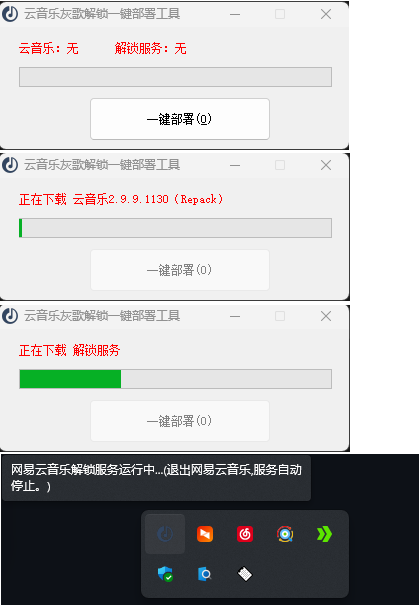

Win10&11 x64系统下一键开启nondanee 的“云音乐灰歌曲解锁”服务。

##系统要求：  WIN10 WIN11 X64；

##管理员模式运行
##部署不完整，请挂代理

功能：就是功能整合，没有技术含量。

1.首次运行，需要单击一下“一键部署”按钮，经反复测试，没有问题，只要能正常访问GITHUB，就能正常下载部署。部署成功后将，自动创建解锁版桌面快捷方式，下次运行快捷方式即可；

需要重新部署，只要删除同目录下的 .ini 文件或其它可执行程序均可再次显示 GUI。 

2.云音乐目前可用的最高版本为 2.9.9.1130，使用的是“我爱破解论坛”大神roqi提供的Repack版，不升级，配置与主程序在同一目录下，方便绿携。

3.使用快捷方式 无GUI启动 unblockneteasemusic-win-x64.exe 并自动给云音乐设置代理模式，使用默认的端口配置。

4.不使用本程序运行云音乐主程序时为 无代理模式，方便有时候开代理不能回传音乐至网盘。

5.退出云音乐时，自动结束 unblockneteasemusic-win-x64.exe 后台进程并恢复云音乐原设置（无代理模式）  
  

鸣谢：

https://github.com/nondanee/UnblockNeteaseMusic

https://github.com/UnblockNeteaseMusic/server/releases

吾爱破解论坛 roqi  制作的免升级版本 原贴地址：https://www.52pojie.cn/thread-1609706-1-1.html
